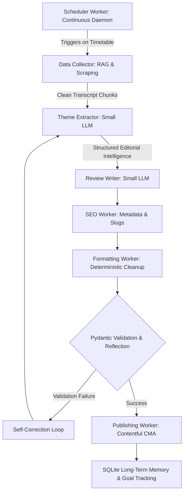

# MangaMotive: Fully Autonomous Agentic Worker Pipeline


> **A low-power, fully autonomous AI publishing newsroom quietly manufacturing premium content for your website 24/7. Optimized for Raspberry Pi 5 8GB.**

---

## 🌟 Executive Summary & Core Philosophy

### **Do NOT build:**
* ❌ One giant AI agent
* ❌ One giant prompt
* ❌ One giant monolithic workflow

### **DO build:**
* ✅ Many tiny deterministic workers
* ✅ Each with exactly ONE focused responsibility
* ✅ Each producing strict, predictable structured outputs

When building autonomous publishing systems on resource-constrained hardware like a **Raspberry Pi 5 8GB**, relying on massive, monolithic AI agents fails catastrophically. As context windows grow, RAM usage explodes, outputs become inconsistent, hallucinations multiply, and debugging becomes impossible. 

**MangaMotive** solves this by establishing a rigorous **7-Stage Deterministic Worker Pipeline**. By dividing complex reasoning into isolated, sequential tasks (e.g., extracting themes first, then writing based *only* on those themes), we drastically reduce the cognitive burden on the LLM. This enables tiny local models like **Gemma 4 E2B**, **Qwen2.5 3B**, or **Phi-3 Mini** to achieve incredible, state-of-the-art editorial quality without cooking your hardware.

---

## 🏗️ The 5 Pillars of Full Autonomy



### 1. Continuous Execution Loop (True Autonomy)
Instead of executing a single run and exiting, MangaMotive runs as a persistent background daemon using `APScheduler` and `asyncio`. It polls `AnimeScheduleService` daily to monitor real-time timetable shifts and automatically queues recap jobs when new episodes air.

### 2. LLM Tool Calling & Planning (ReAct Architecture)
The pipeline orchestrator dynamically decides the execution flow based on local SQLite state and available tools, ensuring duplicate series or episodes are never ingested twice.

### 3. Autonomous Web Research & RAG (Grounding)
To eliminate LLM hallucinations, the **Data Collector Worker** gathers real-time facts, MyAnimeList synopses, and clean transcript chunks before any generation occurs.

### 4. Reflection & Self-Correction (Agentic Feedback Loop)
Equipped with an advanced **Pydantic Reflection Loop**, if Ollama generates malformed JSON or invalid schemas, the service intercepts the `ValidationError` and feeds it back to the model with explicit correction instructions up to 3 times before logging a failure.

### 5. Long-Term Memory & Goal Tracking
The system maintains a robust SQLite database (`agent_memory.db`) tracking `Series`, `Episodes`, `Articles`, `Reviews`, and historical `Jobs` to manage long-term editorial milestones.

---

## ⚙️ The 7 Specialized Workers

### 1. Scheduler Worker (`workers/scheduler.py`)
* **Responsibility**: Controls the entire system. Checks release schedules, starts pipelines automatically, queues jobs, and controls timing.
* **AI Needed**: ❌ None. Pure Python async automation.

### 2. Data Collector Worker (`workers/collector.py`)
* **Responsibility**: Collects raw information. Fetches episode metadata, downloads subtitles, scrapes synopsis, ratings, and character data.
* **AI Needed**: ❌ None. Mostly APIs + scraping.
* **Output Example**:
  ```json
  {
    "title": "One Piece Episode 1129",
    "summary": "Luffy and his crew face off against Kizaru on Egghead Island...",
    "subtitles": "[00:01] We must protect our friends at all costs!...",
    "characters": ["Luffy", "Kizaru", "Vegapunk"]
  }
  ```

### 3. Theme Extractor Worker (`workers/theme_extractor.py`)
* **Responsibility**: Uses a small LLM to identify emotional themes, detect pacing, extract standout moments, and summarize narrative direction from cleaned transcript chunks.
* **AI Needed**: ✅ Small LLM (`gemma:2b` / `qwen2.5`).
* **Why Important**: Converts chaotic raw text into structured editorial intelligence.

### 4. Review Writer Worker (`workers/review_writer.py`)
* **Responsibility**: The main content generator. Takes structured themes from Worker 3 and drafts a beautifully flowing article.
* **AI Needed**: ✅ Small LLM (`gemma:2b` / `qwen2.5`).
* **Important**: The writer does NOT need to analyze everything anymore. Heavy reasoning was done earlier, dramatically improving small-model quality.

### 5. SEO Worker (`workers/seo_worker.py`)
* **Responsibility**: Separate SEO from writing. Generates SEO titles (<60 chars), slugs, meta descriptions (<160 chars), keywords, and tags.
* **AI Needed**: ✅ Small LLM (`gemma:2b`).
* **Why Separate?**: Combining SEO constraints into the main writing prompt severely pollutes prose quality.

### 6. Formatting Worker (`workers/formatter.py`)
* **Responsibility**: Pure cleanup layer. Cleans markdown, fixes heading hierarchy (ensuring H2/H3 compliance), removes duplicate whitespaces, calculates word counts, and extracts excerpts.
* **AI Needed**: ❌ None. Pure deterministic Python regex.

### 7. Publishing Worker (`workers/publisher.py`)
* **Responsibility**: Final automation layer. Uploads binary media assets to Contentful, formats localized Contentful schemas (`review`, `blogPost`, `episodeSummary`), calls Contentful Management API, and synchronizes SQLite state.
* **AI Needed**: ❌ None. Pure API automation.

---

## 💻 Hardware & Software Stack

### **Recommended Hardware**
* **Raspberry Pi 5 8GB** (Active cooler & Official 27W PSU mandatory).
* **NVMe SSD via PCIe HAT** (Do NOT run LLMs from microSD to prevent corruption).

### **Software Stack**
* **Runtime**: Ollama (`http://localhost:11434`).
* **Models**: Gemma 4 E2B Q4_K_M, Qwen2.5 3B, Phi-3 Mini.
* **Orchestration**: Python 3.11+, FastAPI, Pydantic v2, SQLAlchemy.
* **Storage**: SQLite (`./data/agent_memory.db`).
* **CMS**: Contentful Management API (CMA).

---

## 🚀 Installation & Operating Manual

### **1. Environment Setup**

Clone the repository and install dependencies:
```bash
cd "/Users/alpha/Desktop/antigavity/website agent"
python3 -m venv venv
source venv/bin/activate
pip install -r requirements.txt
```

### **2. Configuration (`.env`)**

Copy the example configuration file and populate your tokens:
```bash
cp .env.example .env
```
Ensure your `CONTENTFUL_MANAGEMENT_TOKEN`, `CONTENTFUL_SPACE_ID`, and `ANIMESCHEDULE_API_KEY` are correctly configured.

### **3. Running the Agent Daemon**

Start the FastAPI server and background worker loop:
```bash
uvicorn main:app --host 0.0.0.0 --port 8000 --reload
```

---

## 🌐 REST API Endpoints

### **1. Manually Trigger a Pipeline Job**
* **Endpoint**: `POST /api/trigger`
* **Payload**:
  ```json
  {
    "target_type": "episode_recap",
    "series_title": "One Piece",
    "episode_number": 1129
  }
  ```
* **Response**: Returns the newly queued `Job` object and initiates background processing.

### **2. Monitor Active & Historical Jobs**
* **Endpoint**: `GET /api/jobs`
* **Query Params**: `skip=0`, `limit=50`

### **3. Inspect Specific Job State & Worker Payloads**
* **Endpoint**: `GET /api/jobs/{job_id}`
* **Response**: Returns the complete state progression, including `collector_data`, `theme_data`, `writer_data`, `seo_data`, `formatter_data`, and `publisher_data`.

### **4. View Tracked Series Knowledge Base**
* **Endpoint**: `GET /api/series`

---

## 🏆 Current Achievements & Roadmap

* **7-Worker Architecture**: Completely implemented in modular, high-performance Python.
* **Zero-Loss Binary Uploads**: Seamlessly downloads remote media and pushes binary streams to Contentful CMA.
* **Self-Correction Resilience**: Automatic 3-retry Pydantic reflection loop guarantees schema compliance.
* **Local Source of Truth**: SQLite persistence prevents duplicate CMS entries.

### **Future Enhancements**
* **Cloud Image Generation**: Integrate Fal.ai or Replicate for dynamic thumbnail creation.
* **Vector RAG**: Expand SQLite to support pgvector/ChromaDB for deep lore retrieval.
