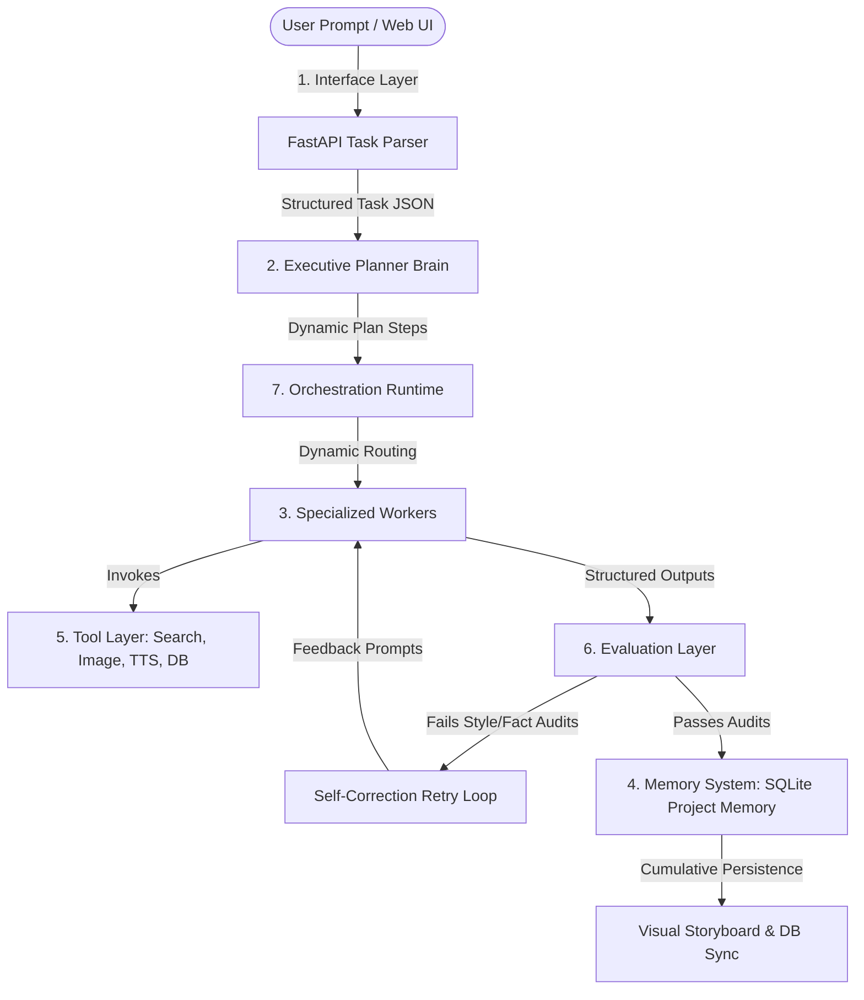

# MANO: Autonomous Multi-Agent Intelligence Harness


> **A 7-layer dynamic intelligence harness designed to orchestrate raw AI models into a coordinated, self-correcting, and learning thinking machine. Persists cumulative preferences and features a live execution dashboard with storyboard synchronizations.**

---

## 🏗️ Architectural Improvements (The 7 Layers)

Instead of a fixed, sequential linear pipeline, the system has been re-architected into a generalized **7-Layer Intelligence Harness**:



### 1. Interface Layer (`static/index.html`, `static/app.js`)
Where user prompts enter. It takes raw requests (e.g. *"Make a 60s YouTube short about Luffy's Gear 5 battle on Egghead island in a hype style"*) and uses the LLM parser to extract a `StructuredTask` containing:
* `topic`
* `style`
* `target_platform`
* `duration`
* `assets_needed`

### 2. Planner / Executive Brain (`workers/planner.py`)
Analyzes the `StructuredTask` and dynamically compiles an ordered `ExecutionPlan` containing custom plan steps, descriptions, and worker assignments, rather than running a hardcoded timeline.

### 3. Specialized Workers (`workers/harness_workers.py`)
Focused worker agents designed around specific tasks:
* **Research Worker**: Collects synopses, characters, and transcript facts.
* **Script Writer**: Compiles narration scripts, honoring tone and style guides.
* **Lore Checker**: Audits script canon consistency in the franchise universe.
* **Thumbnail Strategist**: Designs cover layouts and prompt commands.
* **Voice Timing Worker**: Synthesizes narration tracks.
* **Style Consistency / Formatter**: Formats headings and compiles SEO titles/slugs/tags.
* **Fact Verifier**: Evaluates output factual consistency.
* **Publishing Worker**: Merges final deliverables and syncs SQLite database.

### 4. Memory System (`models.py`, `database.py`)
Persists cumulative preference memory to guide agent generations. It maintains:
* `preferred_tone`: e.g. Hype, energetic otaku review style.
* `banned_phrases`: e.g. "In conclusion", "As an AI", "In summary".
* `successful_hooks`: e.g. "This episode changed everything...".
* `style_guide`: e.g. Keep paragraphs under 3 sentences for high readability.
These memory entries are editable from the **Memory Store** panel of the Web Dashboard and are dynamically injected into agent prompts.

### 5. Tool Layer (`services/tool_layer.py`)
Programmatic capabilities provided to specialized workers:
* `web_search(query)`: Real-time search fact retrieval (with local encyclopedia backup).
* `generate_image(prompt)`: Generates/retrieves context-relevant visual image backdrops.
* `text_to_speech(text)`: Synthesizes narration tracks.
* `database_lookup(query)`: Queries local SQLite database history.
* `ffmpeg_assemble(script, audio, images)`: Storyboard timeline compilation.

### 6. Evaluation Layer (`services/evaluator.py`)
Judges worker outputs before saving:
* **Factual Consistency check**: Evaluates generated text against collected facts.
* **Style Audits**: Filters out banned words and verifies tone.
* **Engagement Prediction**: Scores clickability and retention (1-100).
* **Self-Correction loop**: If a check fails, the orchestrator loops back to the worker (up to 3 times) with feedback to regenerate compliant text.

### 7. Orchestration Runtime (`main.py`)
* Controls task queues, retries, step progression status updates, and logs stdout recording for each worker.

---

## 🚀 Installation & Operating Manual

### 1. Setup Environment
```bash
cd "/Users/alpha/Desktop/antigavity/website agent"
python3 -m venv venv
source venv/bin/activate
pip install -r requirements.txt
```

### 2. Start the Orchestrator Service
```bash
./venv/bin/uvicorn main:app --host 0.0.0.0 --port 8000
```
Open `http://localhost:8000` in your web browser to access the dashboard interface.

---

## 🌐 REST API Endpoints

### 1. Interface Parser
* **Endpoint**: `POST /api/harness/parse`
* **Payload**: `{"prompt": "Make an anime review video about Solo Leveling Episode 5"}`
* **Response**: Returns a structured task (`topic`, `style`, `target_platform`, `duration`, `assets_needed`).

### 2. Trigger Pipeline Job
* **Endpoint**: `POST /api/harness/trigger`
* **Payload**: A valid `StructuredTask` JSON object.
* **Response**: Queues the job and begins async dynamic execution.

### 3. Get Persistent Memory Store
* **Endpoint**: `GET /api/harness/memory`
* **Response**: List of persistent style guide parameters.

### 4. Update Memory Store
* **Endpoint**: `POST /api/harness/memory`
* **Payload**: `{"key": "banned_phrases", "value": ["In conclusion", "As an AI"]}`
