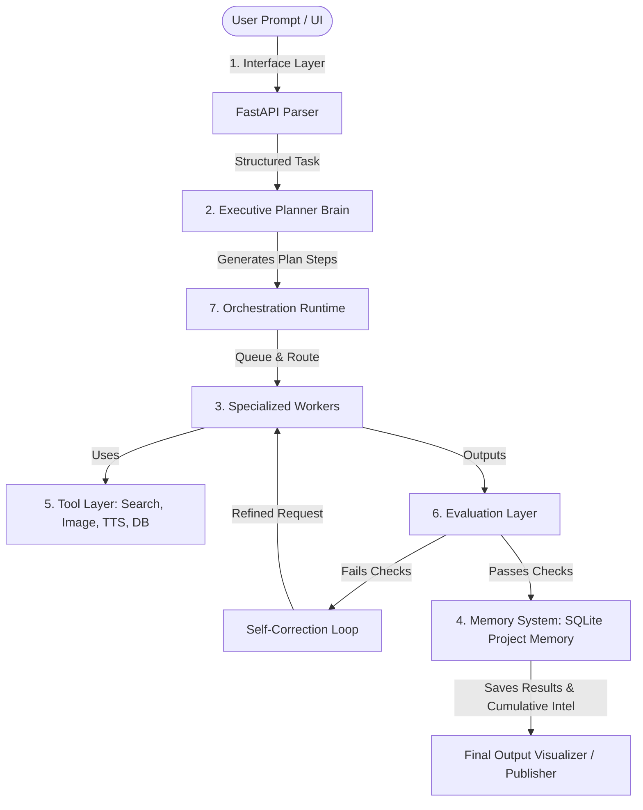

# Implementation Plan - 7-Layer Intelligence Harness Refactoring

This plan outlines the architecture, database modifications, backend logic, and frontend components to transform the **MangaMotive** pipeline into a generalized, dynamic 7-layer **Intelligence Harness**. This turns simple sequential execution into a coordinated thinking machine with self-evaluation, dynamic planning, tool use, and long-term memory.

---

## Architecture Overview (7 Layers)

---

## Proposed Changes

We will restructure the project by modifying existing models and creating new workers and services to implement the 7 layers.

### 1. Database & Schema Layer

#### [MODIFY] [models.py](file:///Users/alpha/Desktop/antigavity/website%20agent/models.py)
* Extend the `Job` model to support dynamic execution plans:
  * `structured_task` (JSON): Stores parsed requirements (topic, style, target_platform, duration, assets_needed).
  * `execution_plan` (JSON): Stores the array of dynamically generated plan steps: `[{"step_id": "...", "name": "...", "worker": "...", "status": "pending|running|completed|failed", "output": "...", "log": "..."}]`
  * `evaluations` (JSON): Stores scoring and criteria evaluation logs (schema validation, style checks, factual consistency, engagement).
  * `memory_logs` (JSON): Stores records of project memory entries read or updated during execution.
* Create a `ProjectMemory` table to store cumulative editorial memory:
  * `key` (String, Primary Key): e.g., `preferred_tone`, `banned_phrases`, `successful_hooks`, `style_guide`.
  * `value` (JSON): List of strings or configurations.

#### [MODIFY] [schemas.py](file:///Users/alpha/Desktop/antigavity/website%20agent/schemas.py)
* Add Pydantic schemas for the new Interface and Planner structures:
  * `StructuredTask`: Fields for `topic`, `style`, `target_platform`, `duration`, `assets_needed`.
  * `ExecutionStep`: Fields for `step_id`, `name`, `worker`, `description`.
  * `ExecutionPlan`: List of `ExecutionStep` objects and a plan title.
  * `HarnessRequest`: User query text.

---

### 2. Services & Core Logic

#### [MODIFY] [services/ollama_service.py](file:///Users/alpha/Desktop/antigavity/website%20agent/services/ollama_service.py)
* **Robust Offline Fallback**: Catch network/API errors when connecting to the local Ollama instance. If Ollama is offline, automatically fall back to a schema-compliant mock generator that utilizes standard templates or generative mocks. This ensures the app is fully functional out of the box.

#### [NEW] [services/tool_layer.py](file:///Users/alpha/Desktop/antigavity/website%20agent/services/tool_layer.py)
* Provide the workers with tool executions:
  * `web_search(query)`: Simulates real-time fact retrieval (using DuckDuckGo scraper or a mock search database with anime series trivia).
  * `generate_image(prompt)`: Generates simulated visual assets (mock URLs/assets).
  * `text_to_speech(text)`: Simulates TTS audio file generation.
  * `database_lookup(query)`: Searches SQLite DB series and memory entries.
  * `ffmpeg_assemble(script, audio, images)`: Simulates compiling script, audio narration, and visual slides into a final video output.

#### [NEW] [services/evaluator.py](file:///Users/alpha/Desktop/antigavity/website%20agent/services/evaluator.py)
* Create checks for intermediate/final worker outputs:
  * `verify_schema(data, pydantic_model)`: Validates structured output.
  * `verify_facts(text, sources)`: Cross-references content text against research facts using LLM evaluation.
  * `verify_style(text, tone_setting, banned_phrases)`: Checks for violations of project guidelines.
  * `predict_engagement(text)`: Evaluates clickability and audience retention potential.

---

### 3. Executive Brain & Workers

#### [NEW] [workers/planner.py](file:///Users/alpha/Desktop/antigavity/website%20agent/workers/planner.py)
* Uses the LLM to analyze the `StructuredTask` and output a structured `ExecutionPlan` containing custom ordered steps.

#### [NEW] [workers/harness_workers.py](file:///Users/alpha/Desktop/antigavity/website%20agent/workers/harness_workers.py)
Define our suite of worker agents:
* **Research Worker**: Uses `web_search` and scrapes facts about the series/episode.
* **Script Writer**: Compiles a video narration script or blog post based on research.
* **Lore Checker**: Audits the draft for factual consistency in the anime/manga's universe.
* **Thumbnail Strategist**: Creates thumbnail ideas and calls the image generation tool.
* **Voice Timing Worker**: Simulates audio narration generation and schedules subtitle timings.
* **Style Consistency / Formatter**: Enforces editorial styles and formats markdown.
* **Fact Verifier**: Evaluates output accuracy.
* **Publishing Worker**: Syncs state to SQLite DB and Contentful.

---

### 4. Orchestration Runtime & REST API

#### [MODIFY] [main.py](file:///Users/alpha/Desktop/antigavity/website%20agent/main.py)
* Update orchestration runtime (`background_job_processor_daemon` and `process_single_job`) to handle dynamic plan execution:
  1. Retrieve a queued job.
  2. Parse the request using the Interface parser, updating `structured_task`.
  3. Generate the execution plan using the Planner, updating `execution_plan` in the database.
  4. Loop through each plan step:
     * Mark step status as `running`.
     * Retrieve relevant prompt inputs, inject project memory (banned phrases, style guidelines), and call the worker agent.
     * If the worker uses tools, invoke the tool from `tool_layer.py`.
     * Send output to the **Evaluation Layer**. If it fails style/banned words or fact consistency, feed the failure back to the worker for correction (self-correction loop, max 3 retries).
     * Mark step status as `completed` (or `failed`) and save output.
  5. Assemble final output and update Job status.
* Serve the modern frontend dashboard by mounting static directory `/static` and pointing `/` to `/static/index.html`.
* Add endpoints:
  * `POST /api/harness/parse`: Text prompt parsing.
  * `POST /api/harness/trigger`: Start harness job.
  * `GET /api/harness/memory`: Get project memory settings.
  * `POST /api/harness/memory`: Save project memory configurations.

---

### 5. Interface Layer: Web Dashboard

#### [NEW] [static/index.html](file:///Users/alpha/Desktop/antigavity/website%20agent/static/index.html)
* Create a modern, high-end dashboard structure. Includes sidebar navigation, tab containers, real-time log terminal, task configurations, memory cards, and a media player representation.

#### [NEW] [static/style.css](file:///Users/alpha/Desktop/antigavity/website%20agent/static/style.css)
* Design systems style sheet:
  * Dark mode design: `#0d0f12` background, deep cards with `#161a22`, border-radius 12px, backdrop-filter blur.
  * Harmonious accent colors: HSL blues, purples, and emerald greens (`#4f46e5`, `#10b981`).
  * CSS micro-animations: Pulse glowing indicators, timeline step hover effects, slide-in transitions.
  * Responsive layout using Grid/Flexbox.

#### [NEW] [static/app.js](file:///Users/alpha/Desktop/antigavity/website%20agent/static/app.js)
* Frontend logic:
  * Dynamic form submission: Sends prompt -> receives structured parsing -> lets user edit inputs -> submits job.
  * Live monitoring: Polls `/api/jobs/{job_id}` every 2 seconds, displaying progress of each step on the timeline.
  * Interactive logs terminal: Displays current logs for the running worker.
  * Memory configuration manager: Read, update, and delete preferences.
  * Media renderer: Displays generated visuals, transcription script, TTS mock audio, and SEO slugs.

---

## Verification Plan

### Automated/Local Tests
* Launch FastAPI server: `python3 main.py`
* Verify API endpoints using `curl` or FastAPI interactive docs `/docs`:
  * Parse prompt endpoint: `/api/harness/parse`
  * Job triggering: `/api/harness/trigger`
  * Memory management: `/api/harness/memory`
* Verify that if Ollama is unavailable, the fallback service activates and execution completes successfully.

### Manual Verification
* Open `http://localhost:8000` in the browser.
* Submit a request like `"Make anime review video for Solo Leveling Episode 5"`.
* Monitor the real-time execution steps on the timeline.
* Add a banned word (e.g. `"In conclusion"`) to the Memory Store, re-run, and verify that the evaluation layer correctly catches and filters or regenerates the text to avoid it.
